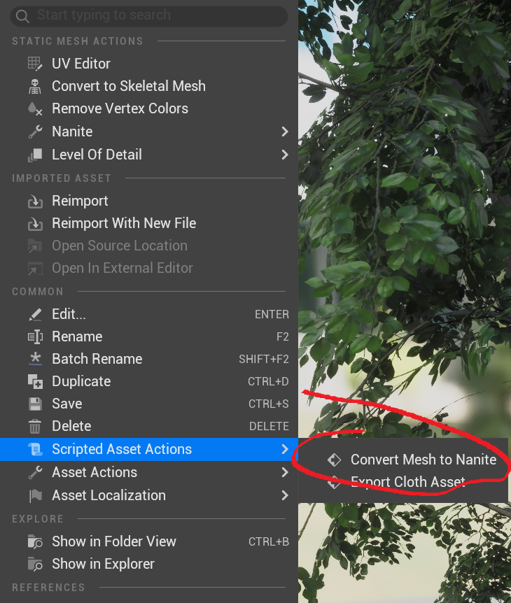
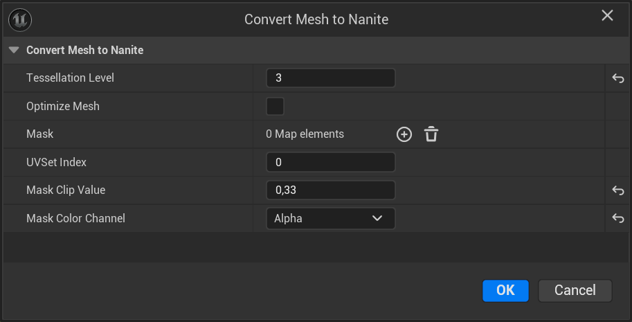

# MaskedMaterialToNanite

MaskedMaterialToNanite is a Unreal Engine plugin which converts static meshes with masked materials to pure geometry based on texture masks.

## Usage

**Step 1**: Right-click on a static mesh and select _Scripted Asset Actions -> Convert Mesh to Nanite_. 

**Step 2**: Enter desired configuration options (described below) and run the action. A new static mesh with *_Nanite* appended will be created with the same materials.

**Step 3**: Swap masked materials in the resulting mesh for opaque versions.

**Step 4**: Profit!

## Configuration

* **Tessellation Level** - The main configuration option describing the level of detail of resulting geometry. The higher the level, the more triangles will be produced and the more accurate the result will be to the mask. The ideal level should be the _lowest_ that gives the _accurate_ results.
* **Optimize Mesh** - Removes unneeded triangles after processing the mesh. This is _SLOW_ for large meshes with high tessellation levels, so should be used after reaching the desired result. For really large meshes, it's better to use an external tool for optimization, e.g. Blender, for better performance.
* **Mask** - Map from material slots to mask textures. Every masked material used should have a slot name, which then can be used in the map to specify the actual mask texture. Geometry lying on transparent texels will be removed.
* **UVSet Index** - UV set to use for texture lookup.
* **Mask Clip Value** - Geometry lying on mask texels with values higher than the clip value will be retained, while the rest will be removed.
* **Mask Color Channel** - Mask channel to use.
  
